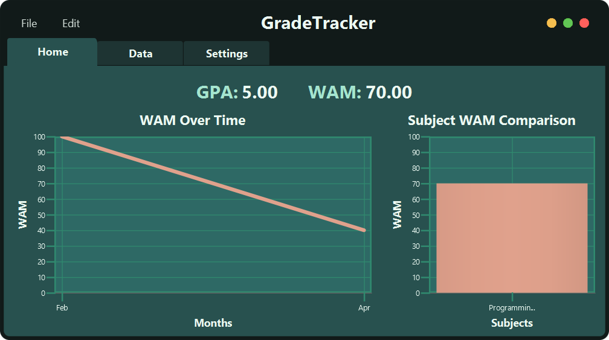
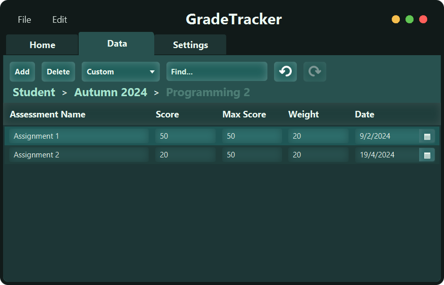
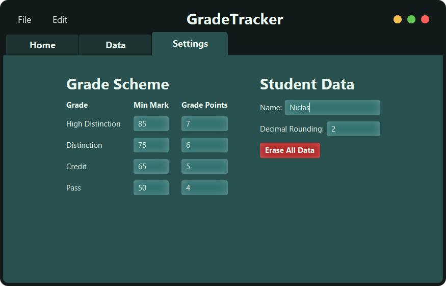

# Grade Tracker 📊

**Grade Tracker** is a JavaFX application built to help university students manage their grades effortlessly. It
provides a clean, customisable UI with intuitive keybinds and advanced functionality for tracking grades, weighted
averages, and overall performance.

## 🎯 Features
- **📈 GPA & WAM Calculation** – Automatically computes your GPA and Weighted Average Mark (WAM).
- **📊 Visual Performance Tracking** – View your grade trends over time with interactive charts.
- **⌨️ Keyboard Shortcuts** – Navigate and edit data quickly with custom keybinds.
- **🛠️ Customisable Grade Scheme** – Adjust grading scales to match different university requirements.
- **📂 Data Organisation** – Categorise grades by subject, semester, and individual assessments.

---

## 🖼️ Screenshots

### **🏠 Home Tab – Overview of Your Performance**
The Home Tab provides a quick overview of your academic performance, giving you a snapshot of your current GPA and WAM.
You'll find visual graphs that track your progress over time, helping you stay on top of your performance in each
subject.

---

### **📑 Data Tab – Grade Management**
The Data Tab is your central hub for managing all your subjects, assessments, and grades. Here, you can add new
subjects, edit details of existing ones, and organise your assessments in a structured manner. This tab ensures that
you can easily track and input all the information you need to calculate your grades.

* **Session & Subject Management:** Add and edit sessions and subjects, including names, credit points and other details.
* **Assessment Organisation:** Keep track of all assessments along with their important weightings and due dates.
* **Grade Calculation:** Automatically calculates your current grade based on the entered assessment scores and weights.

---

### **⚙️ Settings Tab – Personalisation Options**
In the Settings Tab, you can personalise your Grade Tracker to match your grading system and preferences. Whether you
use different grading schemes or have specific preferences, this tab allows you to customise the app to your needs.

* **Grading Scheme Customisation:** Set up your custom grading scale (e.g., min mark and grade points) to reflect your
institution's specific system.

---

## 🚧 Current Status
The application is fully functional, but a working build has not yet been achieved. If you have experience with JavaFX
builds and packaging, I'd love some help! 😊

## 📥 Installation (Coming Soon)
A proper installation guide will be provided once a stable build is available.

## 💡 Contributions & Feedback
If you’d like to contribute, report a bug, or suggest a feature, feel free to open an issue or reach out. Every bit of
help is appreciated!

---

Made with ❤️ using **JavaFX**.